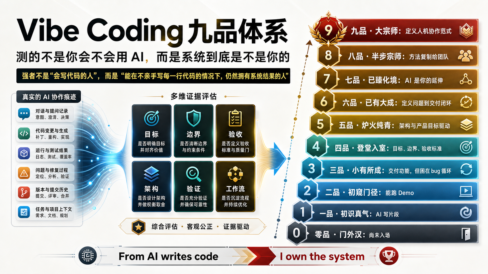

# Vibe Coding Rank

<p align="center">
  
</p>

一个用真实 AI 编程记录来评估开发者 **Vibe Coding 段位** 的 Codex skill，也是一套面向 Airank 的 AI 工作能力产品原型。

> 强者不是“会写代码的人”，而是“能在不亲手写每一行代码的情况下，仍然拥有系统结果的人”。

## 一条命令

```bash
npx github:relaxcloud-cn/vibe-coding-rank --source codex --open
```

它会在本地读取 Codex 会话记录，生成脱敏后的证据摘要，并打开一个可以分享的云端报告链接。

Claude Code：

```bash
npx github:relaxcloud-cn/vibe-coding-rank --source claude --open
```

先看样例：

```bash
npx github:relaxcloud-cn/vibe-coding-rank --demo --open
```

## 为什么做这个

AI 编程能力不应该只靠自评，也不应该只问“你平时用什么工具”“一天烧多少 token”“会不会写 prompt”。

这些问题有传播性，但它们只能描述使用习惯，不能证明一个人是否真的能把 AI 放进工作系统里。

Vibe Coding Rank 想测的是更深的一层：

- 你是否能把模糊目标变成 AI 可执行的产品和工程任务。
- 你是否能控制 AI 的工作边界，而不是让它无限改代码。
- 你是否能判断什么时候该 patch，什么时候该重构。
- 你是否会验证 AI 输出，而不是只看“能不能跑”。
- 你是否能把一次成功协作沉淀成可复用的 workflow、rules、skill 或团队方法。

一句话：**这套体系测的不是你会不会用 AI，而是系统到底是不是你的。**

## 用户会得到什么

用户不是拿到一个冷冰冰的分数，而是拿到一份能分享、能复盘、能升级的报告：

- 我的 Vibe Coding 段位是什么。
- 哪些真实记录支撑了这个段位。
- 哪些证据缺口限制了我的上限。
- 我离下一品差什么。
- 我该把哪些行为沉淀成 workflow、rules、skill 或团队 playbook。

## 它怎么评

这个 skill 会读取 Codex、Claude Code 或通用 AI 编程会话记录，先在本地提取和脱敏证据，再按照九品体系生成评级报告。

现在的判定链路分三步：

```text
原始日志 -> 证据清洗和行为证据卡 -> 自动初筛/AI 深度判定 -> 中文段位报告
```

脚本不再直接充当高段位裁判。它负责把真实记录整理成行为证据卡，标出强证据、弱信号、封顶原因和高段位锁。CLI 默认输出的是 **自动初筛**，用于快速预览；八品和九品必须看更强证据，不能靠信号数量堆出来。

高段位还要看证据跨度：单条记录里写得再完整，也只能算候选证据。六品以上需要跨多次会话、多条强证据反复成立。

它不看你怎么包装自己，只看真实记录里有没有这些行为：

- 目标定义、非目标、验收标准
- 文件范围、模块边界、架构判断
- 测试、构建、lint、截图验证、smoke check
- bug 循环中的根因分析和边界重设
- 多 agent 分工、review gate、检查点
- AGENTS.md、CLAUDE.md、rules、skills、workflow、playbook
- 团队级方法复制和公开影响证据

其中，八品需要证明方法被团队或社区复用；九品需要公开范式影响。普通个人私有日志通常最高只自动确认到七品。

## Vibe Coding 九品体系

| 《庆余年》层级 | Vibe Coding 品级 | 一句话要义 |
|:---|:---|:---|
| 未入门 | **零品 · 门外汉** | 尚未入场。 |
| 四品 | **一品 · 初识真气** | 能用 AI 生成代码片段，但系统是 AI 的，不是你的。 |
| 五品 | **二品 · 初窥门径** | 能拼凑出能跑的 Demo，但控制不了结果，系统还是 AI 的。 |
| 六品 | **三品 · 小有所成** | 能交付功能，但精力耗在修 bug 循环里，系统是拼凑出来的。 |
| 七品 | **四品 · 登堂入室** | 开始用架构和验收标准约束 AI；系统开始是你的。 |
| 八品 | **五品 · 炉火纯青** | 以产品目标驱动 AI；用护栏和检查点控制交付，系统是你的。 |
| 八品顶尖 | **六品 · 已有大成** | 定义问题、设计系统、驱动交付形成闭环；跨领域也能快速建立控制力。 |
| 九品 | **七品 · 已臻化境** | 手段完全透明，注意力只在系统和结果上。AI 是你的延伸。 |
| 九品上 | **八品 · 半步宗师** | 把“拥有系统”的方法论体系化，让团队也能做到。 |
| 大宗师 | **九品 · 大宗师** | 定义人与 AI 的协作范式，重塑行业对“拥有系统”的理解。 |

## 核心分界

一至三品：能让 AI 写代码，但系统归属不稳。典型证据是代码片段、demo、功能交付和反复修 bug。

四至六品：开始真正拥有系统。典型证据是目标定义、边界控制、验收标准、架构判断和交付闭环。

七品：个人能力顶点。工具和代码细节变得透明，注意力集中在系统目标、质量、演进和结果责任上。

八品：方法论可复制。你不只是自己会用 AI，而是能让团队也进入同一套协作范式。

九品：范式创造者。需要公开影响或行业级创造证据，不能只靠私有会话自动判定。

## 输出是什么

一次完整分析会输出：

- 段位结论
- 判定模式：自动初筛或 AI 深度判定
- 置信度
- 系统归属判断
- 硬统计画像：总 token、峰值日 token、活跃天数、日均/会话均 token、峰值集中度、有效样本比例、强证据密度、主动控制占比、信号覆盖度
- 六维能力画像：目标定义、边界控制、验证闭环、架构判断、系统归属、方法复制
- 支撑该段位的行为证据卡
- 限制段位上限的证据缺口
- 八品/九品是否解锁
- 下一品升级路径
- 图片报告提示词：可直接交给 Imagen / imagegen 生成朋友圈海报

示例结构：

```json
{
  "rank": "五品 · 炉火纯青",
  "score": 72,
  "confidence": "medium",
  "judgment_mode": "自动初筛",
  "is_final": false,
  "system_ownership": "strong",
  "usage_stats": {
    "total_tokens": 1280000,
    "peak_day_tokens": 420000,
    "active_days": 6,
    "active_span_days": 6,
    "average_day_tokens": 213333,
    "average_session_tokens": 106667,
    "peak_day_token_share": 0.3281,
    "token_note": "Token 是 AI 投入强度指标，不参与段位升品。"
  },
  "hard_stats": {
    "raw_record_count": 170,
    "analyzed_record_count": 120,
    "scoring_candidate_record_count": 128,
    "scorable_record_ratio": 0.9375,
    "strong_evidence_density": 0.1,
    "user_control_ratio": 0.1667,
    "evidence_span_days": 6,
    "signal_coverage_ratio": 0.6364,
    "dominant_signal_ratio": 0.2321,
    "established_dimension_count": 5,
    "total_tokens": 1280000,
    "active_days": 6,
    "active_sessions": 12,
    "note": "硬统计只描述样本质量和 AI 投入强度，不直接参与段位升品。"
  },
  "dimension_profile": [],
  "evidence_cards": [],
  "rank_caps": [],
  "unlock_status": {},
  "next_rank": "六品 · 已有大成",
  "upgrade_path": [],
  "share_image_prompt": "Use case: infographic-diagram..."
}
```

## 适合谁

- 想知道自己 AI 编程真实水平的开发者
- 想把 Codex / Claude Code 使用记录变成能力报告的人
- 想做 AI-native 工程能力评估的团队
- 想把 Airank 做成“AI 工作能力评级体系”的产品团队

## 本地取证，云端报告

默认模式不上传原始日志。CLI 只把最终报告编码到 URL hash 里，云端页面负责展示：

```bash
npx github:relaxcloud-cn/vibe-coding-rank --source codex --site https://vibe.yisec.ai --open
```

如果想要更适合分享的短链接，可以显式开启短链接模式：

```bash
npx github:relaxcloud-cn/vibe-coding-rank \
  --source codex \
  --short-link \
  --open
```

短链接模式只上传最终报告 JSON 到 Cloudflare KV，不上传原始 Codex / Claude Code 日志。报告默认 30 天过期。

如果你部署到自己的 Worker，也可以指定上传地址：

```bash
npx github:relaxcloud-cn/vibe-coding-rank \
  --source codex \
  --upload-url https://your-worker.example.com \
  --open
```

部署配置在 `wrangler.toml`。默认子域名为 `vibe.yisec.ai`，短链接存储使用 Cloudflare KV namespace `REPORTS`。

常用 CLI 参数：

```bash
--source codex|claude|generic   会话来源
--root <path>                   自定义会话目录或文件
--since YYYY-MM-DD              只扫描指定日期后的记录
--site <url>                    报告站点地址
--upload-url <url>              上传最终报告 JSON，生成短链接
--short-link                    上传最终报告 JSON，使用默认站点短链接
--out <path>                    本地报告 JSON 输出路径
--write-share-prompt <path>     输出脱敏后的图片报告提示词
--no-write                      不写本地报告文件
--print-json                    输出机器可读 JSON
--open                          自动打开报告链接
```

生成朋友圈/海报提示词：

```bash
npx github:relaxcloud-cn/vibe-coding-rank \
  --source codex \
  --write-share-prompt .airank/share-poster-prompt.txt
```

这个文件只包含段位、分数、硬统计、证据摘要、封顶原因和下一步，不包含原始日志、本地路径、session id、源码或密钥。可以直接交给 Imagen、imagegen 或其他图片模型生成中文报告图。

## 作为 Codex skill 使用

在本目录下运行：

```bash
python3 skill/scripts/collect_sessions.py \
  --source codex \
  --root "$HOME/.codex/sessions" \
  --since 2026-02-01 \
  --output /tmp/airank-codex-evidence.jsonl

python3 skill/scripts/prepare_evidence.py \
  --input /tmp/airank-codex-evidence.jsonl \
  --output /tmp/airank-vibe-summary.json
```

Claude Code：

```bash
python3 skill/scripts/collect_sessions.py \
  --source claude \
  --root "$HOME/.claude/projects" \
  --output /tmp/airank-claude-evidence.jsonl
```

然后让 Codex 使用 `$vibe-coding-rank`，读取摘要里的 `evidence_cards`、`rank_caps`、`unlock_status` 和 `skill/references/` 中的判定规则，生成最终中文报告。

## 安装到 Codex

```bash
mkdir -p "${CODEX_HOME:-$HOME/.codex}/skills"
cp -R skill "${CODEX_HOME:-$HOME/.codex}/skills/vibe-coding-rank"
```

调用示例：

```text
Use $vibe-coding-rank to analyze my local Codex sessions and produce a Vibe Coding rank report.
```

## 项目结构

```text
.
├── README.md                        # 项目介绍和使用说明
├── package.json                     # CLI 元信息和本地检查脚本
├── wrangler.toml                    # Cloudflare Worker / 静态资源部署配置
├── apps/
│   └── report-site/                 # vibe.yisec.ai 静态报告页
├── assets/                          # README 和产品展示图
├── docs/
│   ├── deployment/yisec.md          # vibe.yisec.ai 部署说明
│   └── launch-playbook.md           # 宣传运营打法
├── skill/                           # 可单独安装的 Codex skill
│   ├── SKILL.md                     # Skill 入口
│   ├── agents/openai.yaml           # Skill UI 元信息
│   ├── references/                  # 九品体系、证据规则、AI 判定流程、输出结构
│   └── scripts/                     # 本地取证和证据准备脚本
├── src/
│   ├── cli/vibe-rank.mjs            # npx 一条命令入口
│   └── worker/index.js              # Cloudflare Worker API
└── tests/                           # CLI 和脚本回归测试
```

## 隐私原则

原始会话记录可能包含源码、客户信息、业务上下文或 token。默认流程会先在本地提取和脱敏，再生成摘要。

不要把这些文件提交到公开仓库：

- `.airank/`
- `.npm-cache/`
- `.wrangler/`
- `node_modules/`
- `*-evidence.jsonl`
- `*-summary.json`
- `runs/`
- `reports/`

## 测试

```bash
npm run check
```

核心脚本只使用 Python / Node 标准库，没有额外运行时依赖。
